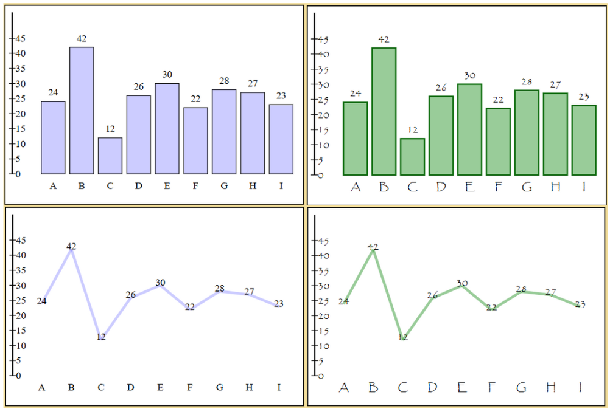

# DiagramCreator

The DiagramCreator is a module that can script diagrams to SVG-elements, based on data objects from the user. 

This module is suitable for smaller diagrams. 


### Example Output
`'themeA'` to the left and `'themeB'` to the right.



## Features

- 📈 Shows data in diagrams.
- 🎨 Customizeable font and colors by using a theme.
- 📏 Customizeable size of the diagram.


## Installation guide

1. Download the files in folder *src*.
2. Place the files in a folder in your project.


## How to use

In your app, import the *index.js* file from the folder that was created. The index.js file has all exports from the module. If the folder name is *src*, it may be imported like this:

```javascript
import { Validator, BarGraph, LineGraph, Theme } from '../src/index.js'
```

In your app's index.html, create an SVG element in the body. It is the SVG element that the module will script the diagrams to.

The *id* set here, will later be used in the constuctor when creating a diagram.

```javascript
<svg id="barGraph" width="450" height="300" xmlns="http://www.w3.org/2000/svg" style="border: 2px, solid;"></svg>
```


### Example of how to use the module:

```javascript
// Instantiate the classes for validation and theme.
const validator = new Validator()
const theme = new Theme()

// Set the id, width and height to the same values
// as the SVG element in the app's index.html.
const barGraph = new BarGraph('barGraph', 450, 300)
const lineGraph = new LineGraph('lineGraph', 450, 300)

// Set the data to create diagrams from.
const rawData = [
  { label: 'A', value: 24 },
  { label: 'B', value: 42 },
  { label: 'C', value: 12 },
  { label: 'D', value: 26 },
  { label: 'E', value: 30 },
  { label: 'F', value: 22 },
  { label: 'G', value: 28 },
  { label: 'H', value: 27 },
  { label: 'I', value: 23 }
]

// Validate the data before it is passed on to diagrams.
const data = validator.validateData(rawData)

// The available options are 'themeA' or 'themeB'.
const selectedTheme = theme.setTheme('themeB')

// Choose font size
const selectedFontSize = theme.setFontSize(15)

// Create the diagrams
barGraph.createBarGraph(data, selectedTheme, selectedFontSize)
lineGraph.createLineGraph(data, selectedTheme, selectedFontSize)
```

When instantiating the BarGraph or LineGraph, the id, width and height need to be set to the same values as set in the SVG element in index.html. It they are not the same, the modules calculations will be incorrect.

Pass the data into Validator for validation of the data array. The Validator will validade the objects and their labels and values in the data array.

Set a theme using Theme. The themes available are `'ThemeA'` and `'ThemeB'`. Font size 15 is recommended, but can be altered by passing a number into the setFontSize method.

At last, create the diagram by passing data, theme and font size parameters into the diagram.


## Dependencies

There are no dependencies in this module, except built-in node functions.


## Technologies

- Vanilla JavaScript
- Node.js


## Disclaimer

This is a module that was created as part of the 1dv610 course at Linnaeus University. As it is a student project, it will not be regularly maintained. 


## Licence

MIT Licence