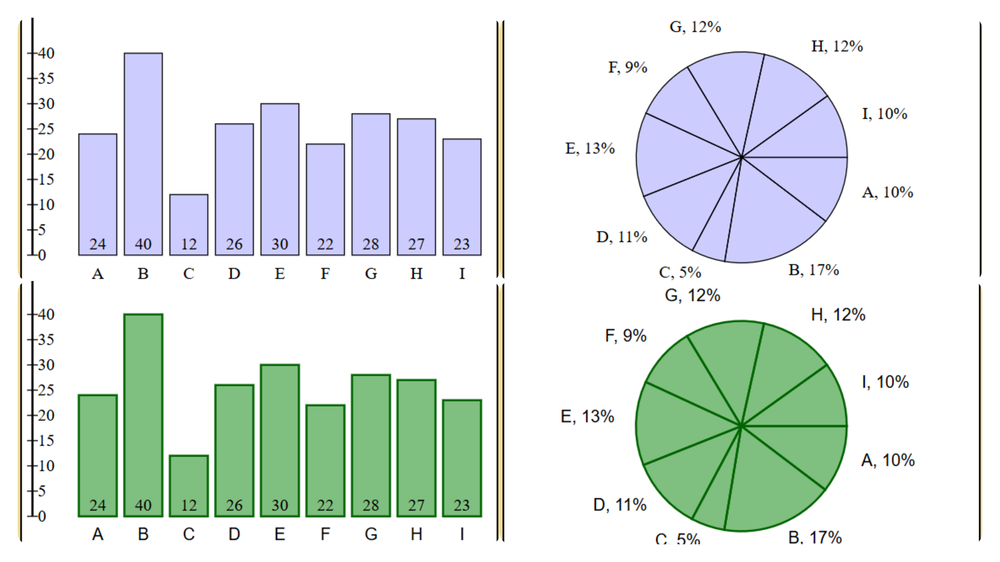
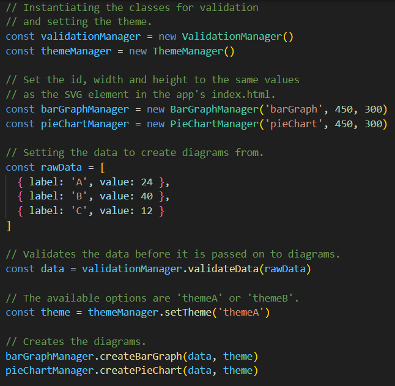

# DiagramCreator

The DiagramCreator is a module that can script diagrams to SVG-elements, based on data objects from the user. 

This module is suitable for smaller diagrams. 


### Example Output
`'themeA'` to the left and `'themeB'` to the right.



## Features

- 📈 Creates an SVG-element that shows the data in diagrams.
- 🎨 Customizeable font and colors by using a theme.
- 📏 Customizeable size of the diagram.


## Installation guide

1. Download the files in folder *src*.
2. Place the files in a folder in your project.


## How to use

In your app, import the *index.js* file from *src* folder. The index.js file has all exports from the module.

```javascript
import { ValidationManager, BarGraphManager, PieChartManager, ThemeManager } from '../src/index.js'
```


In your app's index.html, create an SVG element in the body. It is the SVG element that the module will script the diagrams to.

```javascript
<svg id="barGraph" width="450" height="300" xmlns="http://www.w3.org/2000/svg" style="border: 2px, solid;"></svg>
```


### Example of how to use the module:


When instantiating the BarGraphManager or PieChartManager, the id, width and height need to be set to the same values as set in the SVG element in index.html.

Pass the data into ValidationManager for validation of the array, objects and values.

Set a theme using ThemeManager. The themes available are `'ThemeA'` and `'ThemeB'`. 

At last, create the diagram by passing data and theme parameters into the diagram.


## Disclaimer

This is a module that was created as part of the 1dv610 course at Linnaeus University. As it is a student project, it will not be regularly maintained. 


## Dependencies

There are no dependencies in this module, except built-in node functions.


## Technologies

- Vanilla JavaScript
- Node.js


## Licence

MIT Licence