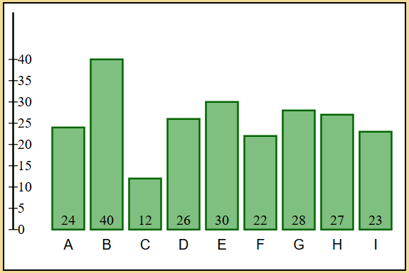
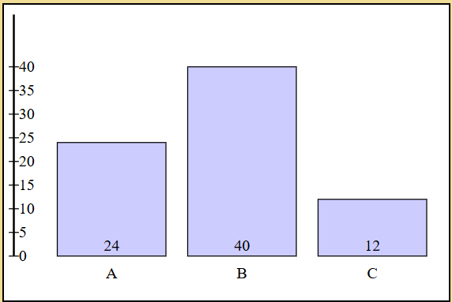
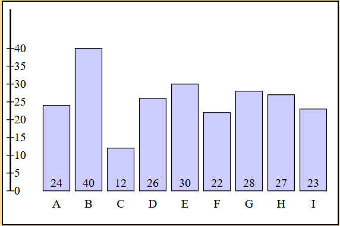
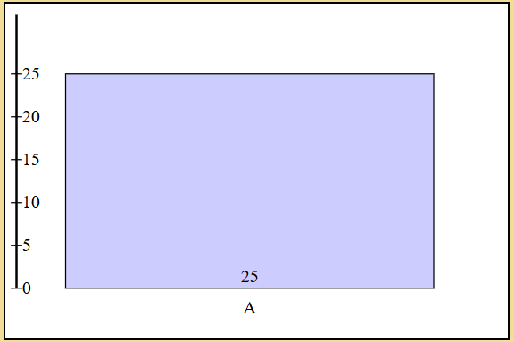
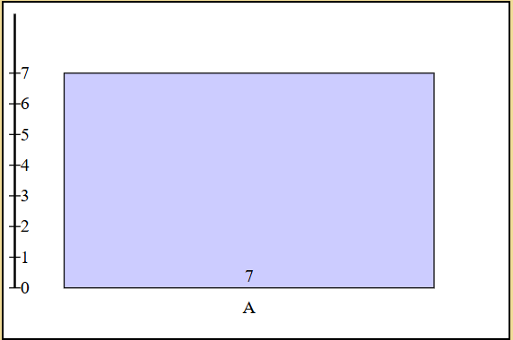

# Tester

### ValidationManager

Förkrav: Det finns en Test-app med en rawData-array av objekt i app.js.
Förkrav: Test-appens index.html är öppnad med Live Server.

#### Testfall 1 - Array

Test 1.1
Beskrivning: Ett meddelande visas om rawData inte är en array, eller om arrayen är tom.

Steg:
1. Öppna Test-appens app.js och bestäm värden.
2. Ändra rawData till att vara ett objekt:
  const rawData = { label: 'A', value: 7 }
3. Observera console i webbläsaren.

Förväntad utdata: Ett meddelande "Data must be a non-empty array". 

Test 1.2 
Beskrivning: Ett meddelande visas om data-array är tom.

Steg:
1. Öppna Test-appens app.js och bestäm värden.
2. Ändra rawData till en tom array:
  const rawData = []
3. Observera console i webbläsaren.

Förväntad utdata: Ett meddelande "Data must be a non-empty array". 

#### Testfall 2 - Värden

Test 2.1 
Beskrivning: Ett meddelande visas om arrayen inte innehåller ett objekt.

Steg:
1. Öppna Test-appens app.js och bestäm värden.
2. Ändra rawData till en array utan objekt:
  const rawData = [1]
3. Observera console i webbläsaren.

Förväntad utdata: Ett meddelande "Data needs be sent as objects in an array and the object cannot be null".

Test 2.2
Beskrivning: Ett meddelande visas om data-arrayen inte har en "label" som är en string.

Steg:
1. Öppna Test-appens app.js och bestäm värden.
2. Ändra rawData-arrayen till att innehålla ett objekt med felaktig "label":
  const rawData = [{ l: 1, value: 24 }]
3. Observera console i webbläsaren.

Förväntad utdata: Ett meddelande "Each label needs to be a string, that is not empty"

2.3 
Beskrivning: Ett meddelande visas om objekt i data-arrayen inte har ett "value" som är ett nummer. 

Steg:
1. Öppna Test-appens app.js och bestäm värden.
2. Ändra rawData-arrayen till att innehålla ett objekt med felaktigt "value":
  const rawData = [{ label: 'A', value: 'a' }]
3. Observera console i webbläsaren.

Förväntad utdata: Ett meddelande "Value needs to be a number".

### ThemeManager

#### Testfall 1 - Bestämma tema

Test 1.1 
Beskrivning: Vid ändring av tema, uppdateras diagrammet.

Steg:
1. Öppna Test-appens app.js och bestäm värden.
2. Ändra i den string som skickas till setTheme metoden:
  const theme = themeManager.setTheme('themeB')
3. Observera diagrammet i webbläsaren.

Förväntad utdata: Diagrammet uppdateras till det nya temat.

Test 1.2
Beskrivning: Vid ej existerande tema, ska ett meddelande visas.

Steg:
1. Öppna Test-appens app.js och bestäm värden.
2. Ändra i den string som skickas till setTheme metoden:
  const theme = themeManager.setTheme('themeC')
3. Observera console i webbläsaren.

Förväntad utdata: Ett meddelande "Choose one of the themes available"

### BarGraphManager

Förkrav: Det finns en Test-app med en rawData-array av objekt i app.js.
Förkrav: Test-appens index.html är öppnad med Live Server.

#### Testfall 1 - Bredd

Test 1.1
Beskrivning: Ett diagram skapas med få antal staplar, lika många som det finns objekt i rawData-arrayen från Test-app.

Steg:
1. Öppna Test-appens app.js och bestäm värden i rawData-arrayen.
2. Sätt värden till: 
  { label: 'A', value: 24 },
  { label: 'B', value: 40 },
  { label: 'C', value: 12 }
3. Observera diagrammet i webbläsaren.

Förväntad utdata: 3 staplar skapas.

Test 1.2
Beskrivning: Ett diagram skapas med många staplar, lika många som det finns objekt i rawData-arrayen.

Steg:
1. Öppma Test-appens app.js och bestäm värden i rawData-arrayen.
2. Sätt värden till:
  { label: 'A', value: 24 },
  { label: 'B', value: 40 },
  { label: 'C', value: 12 },
  { label: 'D', value: 26 },
  { label: 'E', value: 30 },
  { label: 'F', value: 22 },
  { label: 'G', value: 28 },
  { label: 'H', value: 27 },
  { label: 'I', value: 23 }
3. Observera diagrammet i webbläsaren.

Förväntad utdata: 9 staplar skapas.

#### Testfall 2 - Höjd
Test 2.1

Beskrivning: Ett diagram skapas med staplar med högt värde. Staplarnas höjd stämmer överens med axis-linjen till vänster i diagrammet.

Steg:
1. Öppna Test-appens app.js och bestäm värden i rawData-arrayen.
2. Sätt värden till: 
  { label: 'A', value: 25 }
3. Observera diagrammet i webbläsaren.

Förväntad utdata: En stapel skapas som når till 25 på axis-linjen.

Test 2.2
Beskrivning: Ett diagram skapas med staplar med lågt värde. Staplarnas höjd stämmer överens med axis-linjen till vänster i diagrammet.

Steg:
1. Öppna Test-appens app.js och bestäm värden i rawData-arrayen.
2. Sätt värden till:
  { label: 'A', value 7}
3. Observera diagrammet i webbläsaren.

Förväntad utdata: En stapel skapas som når till 7 på axis-linjen.

#### Testfall 3 - Värden
Test 3.1
Beskrivning: Ett diagram skapas med rätt "label" och "value".
Steg:
1. Öppna Test-appens app.js och bestäm värden.
2. Sätt värden till:
  { label: 'A', value: 24 },
  { label: 'B', value: 40 },
  { label: 'C', value: 12 },
  { label: 'D', value: 26 },
  { label: 'E', value: 30 },
  { label: 'F', value: 22 },
  { label: 'G', value: 28 },
  { label: 'H', value: 27 },
  { label: 'I', value: 23 }
3. Observera diagrammet i webbläsaren.

Förväntad utdata: Ett diagram skapas där "label" och "value" stämmer överens med datan.

### PieChartManager

